# @onoumenon

Visit the presentation repo at [tiny.cc/bootcamp](https://github.com/onoumenon/codinggirls-tw-presentatio) 
Or refer to more resources at [onoumenon.gitbook.io/wiki](https://onoumenon.gitbook.io/wiki/)

---

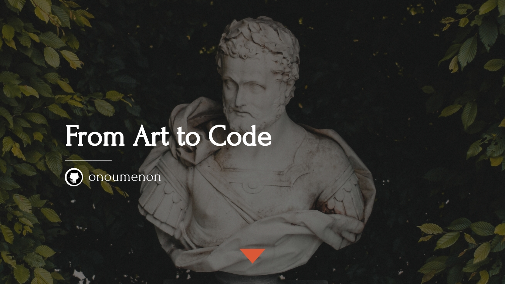

---

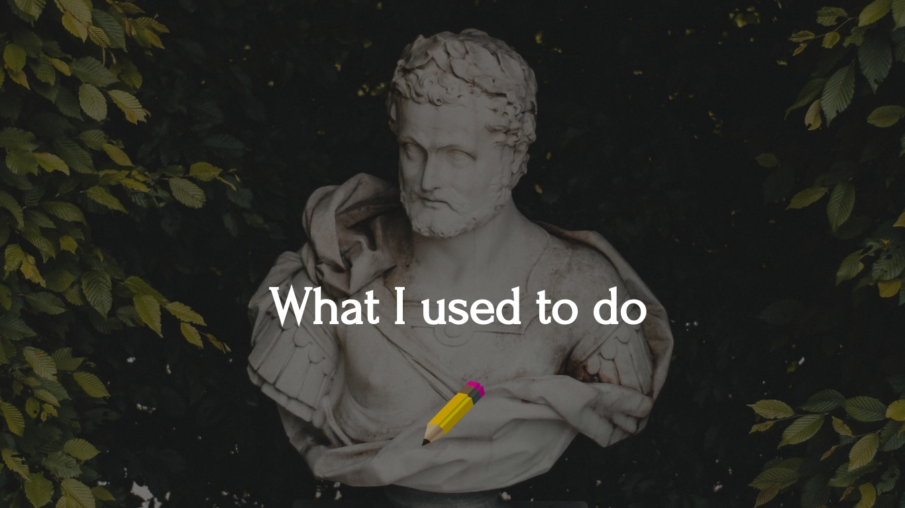

---

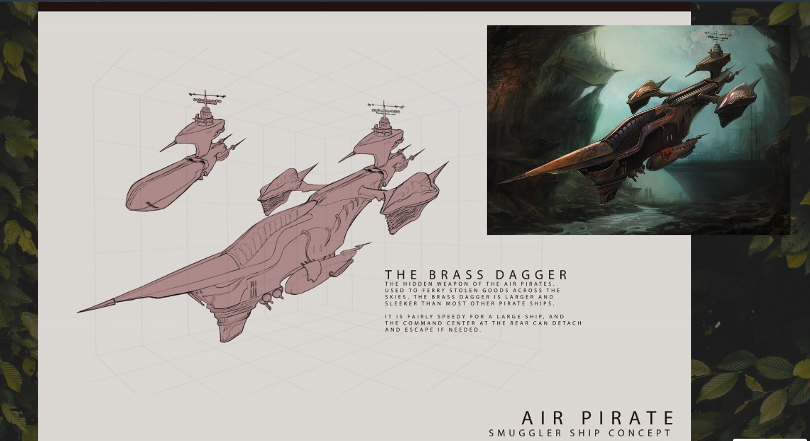

---

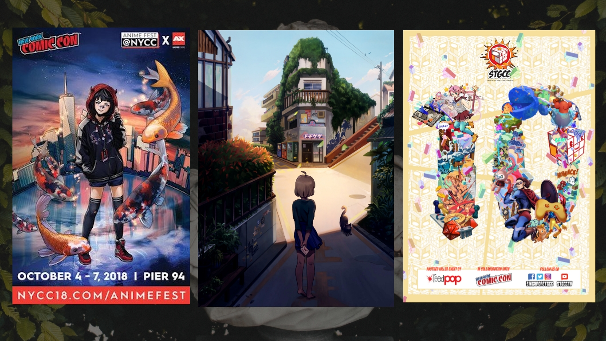

---

---

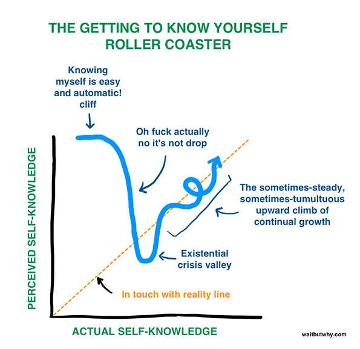

---

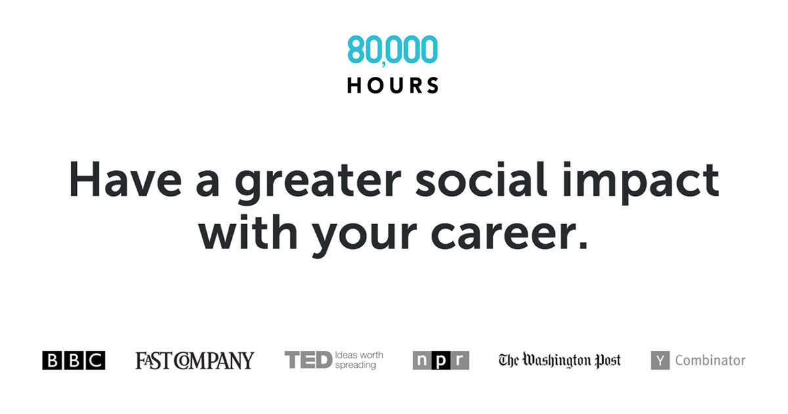

---

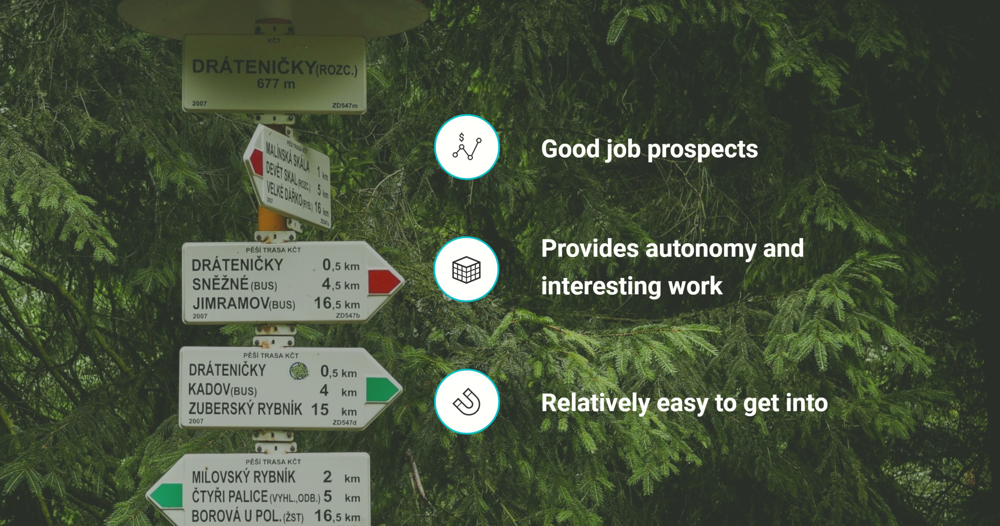

---

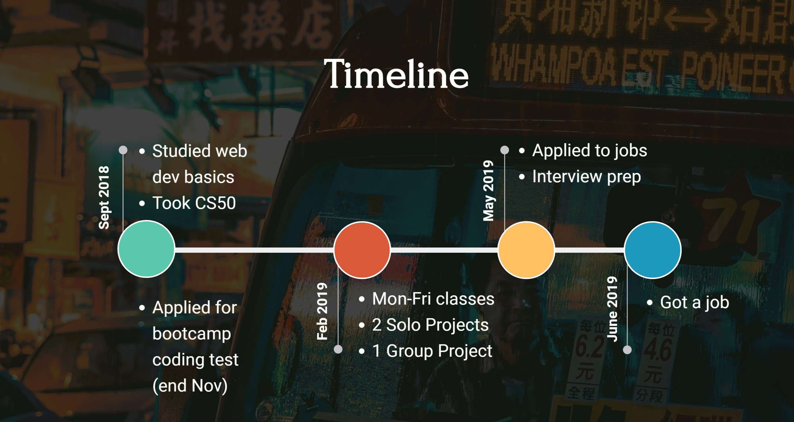

---

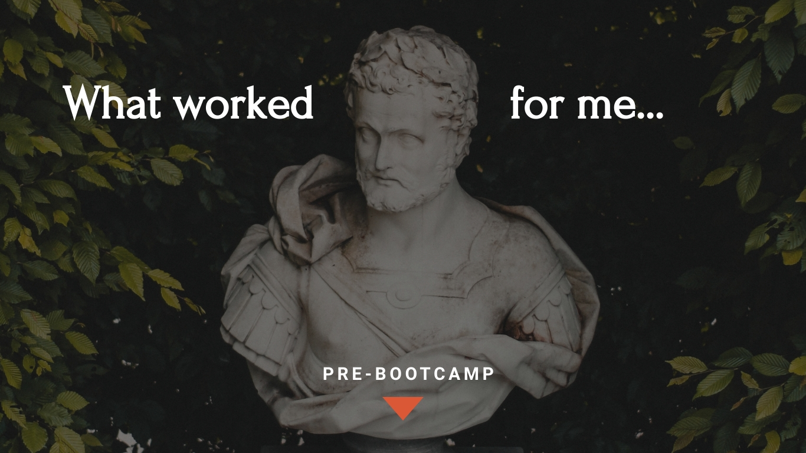

---

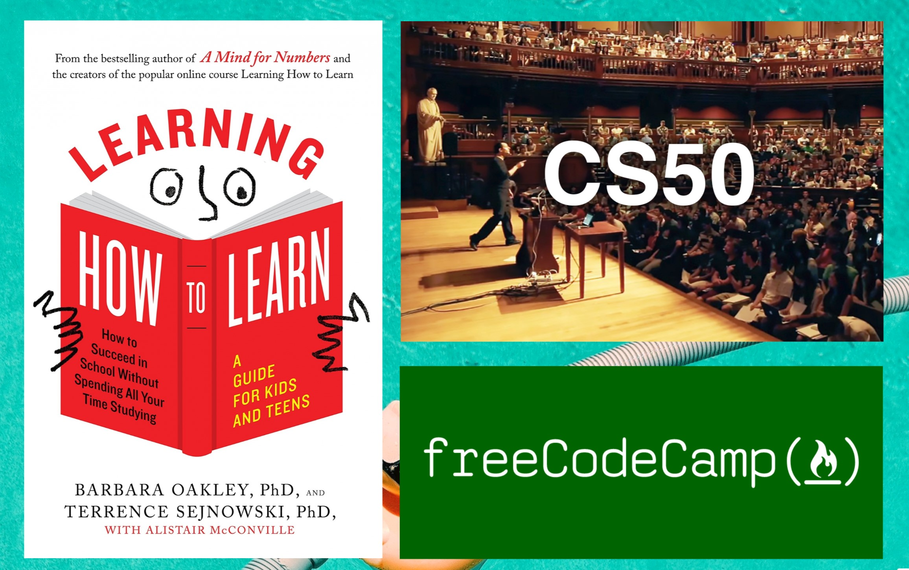

---

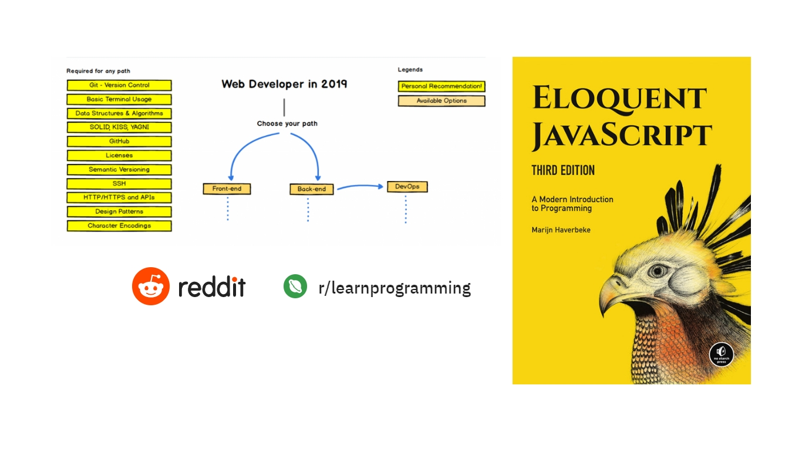

---

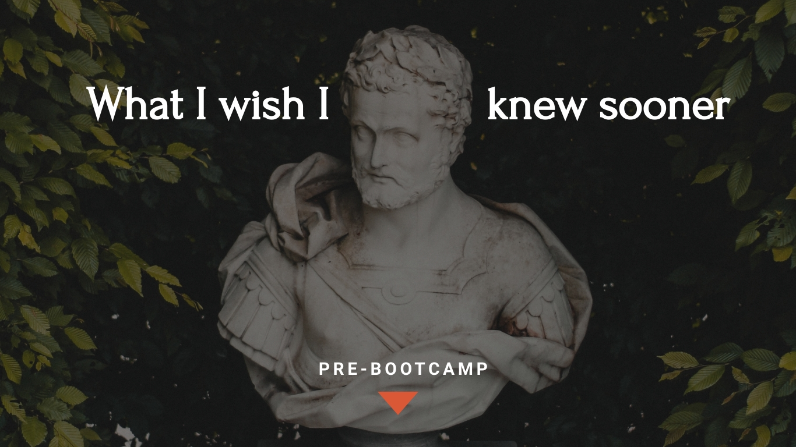

---

# You're gonna be okay.

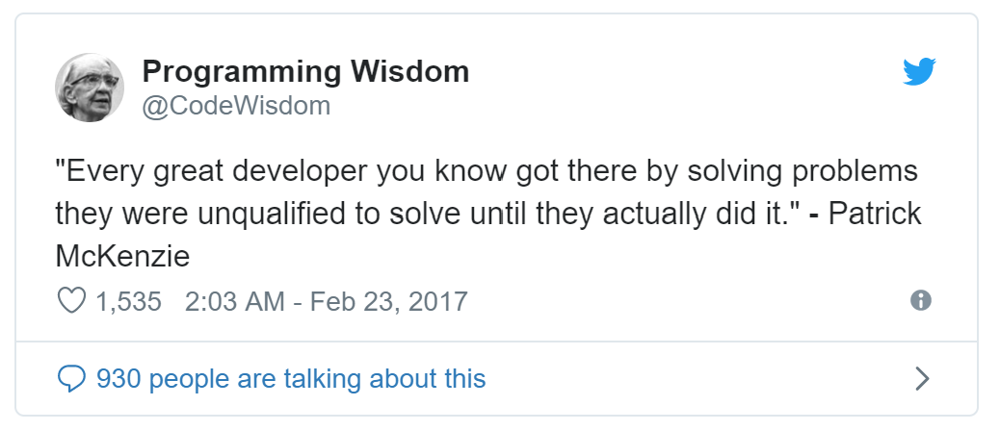

---

# You're gonna get stuck. A lot.

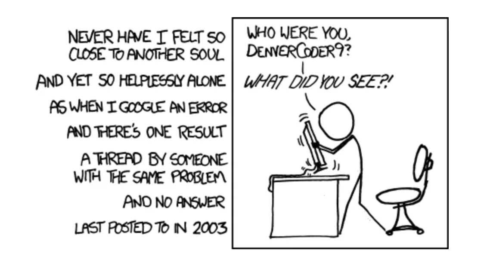

---

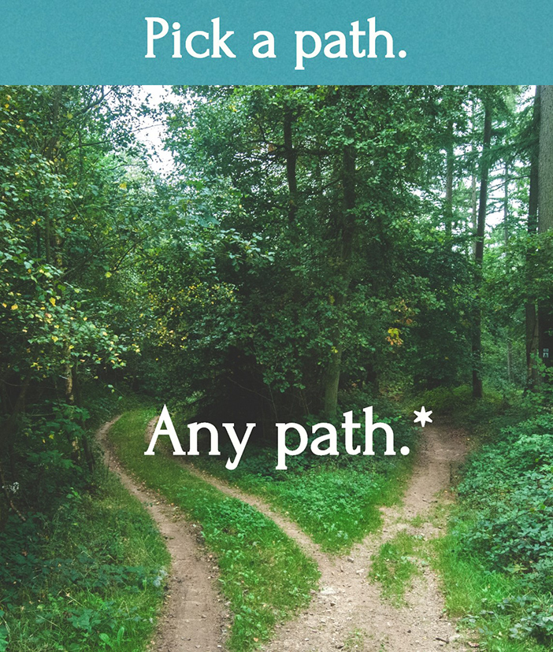

---

# You're gonna fail. But fail small.

---

# Learn in public

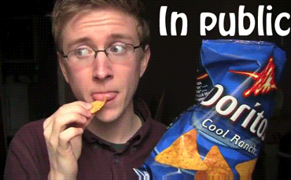

---

# Know your tools.

---

# Don't be afraid to commit.

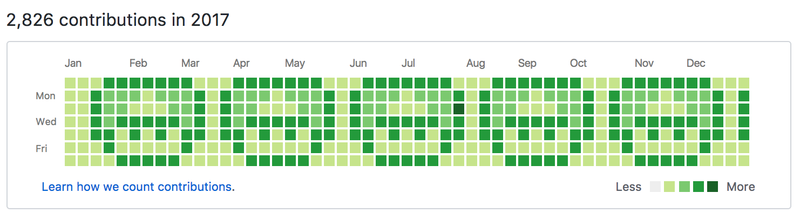

---

# Have fun!

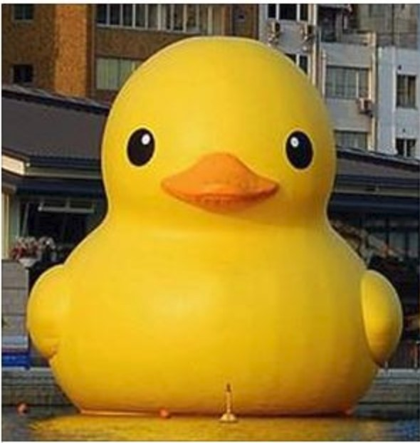

---

# I'm okay so far.

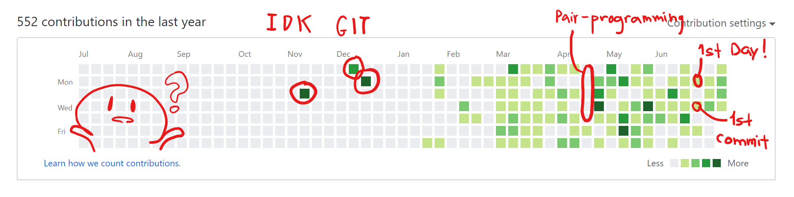

