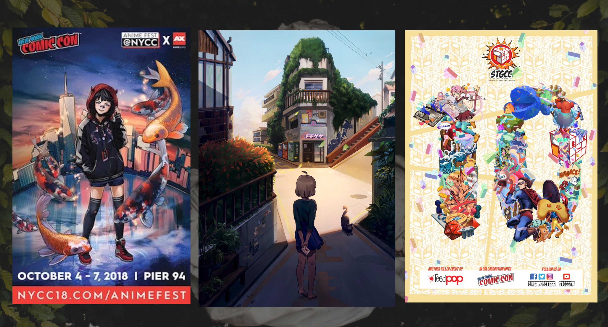
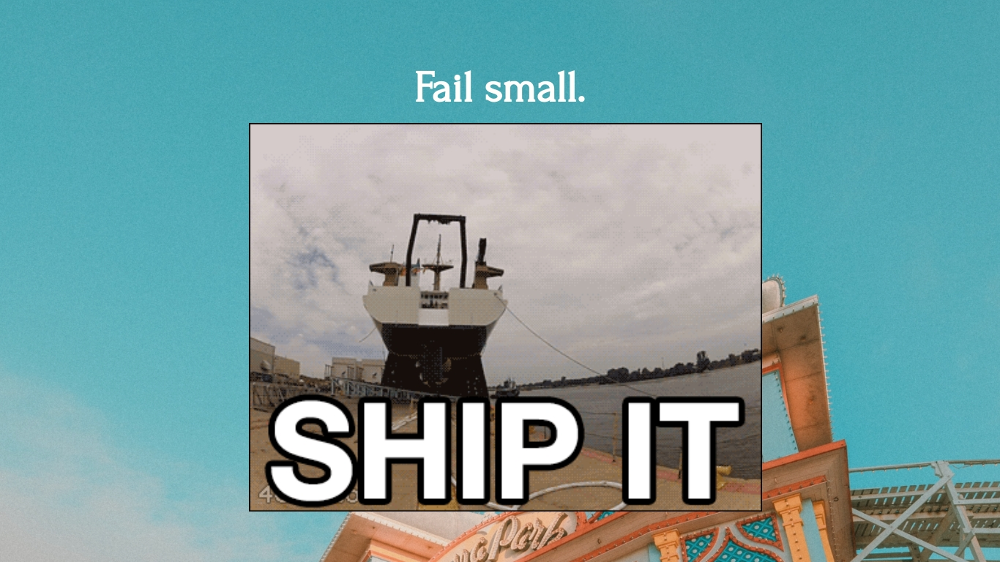
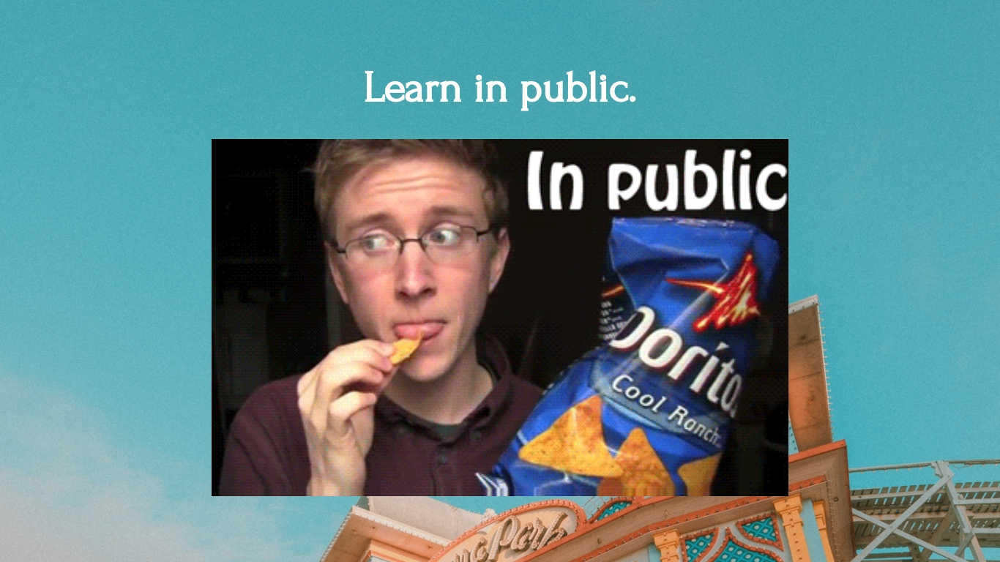
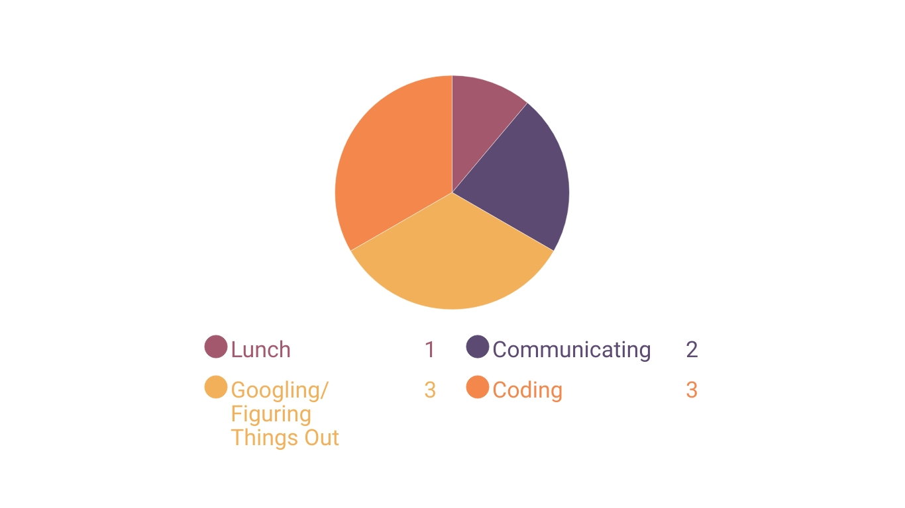

# @onoumenon

🌟 Visit the presentation at [GitHub](https://github.com/onoumenon/codinggirls-tw-presentation),  
or refer to more resources at my [GitBook](https://app.gitbook.com/@onoumenon/s/wiki)

---

---

---

---

---

---

---

---

---

---

---

---

---

---

---

---

---

---

---

---

---

---

---

---

