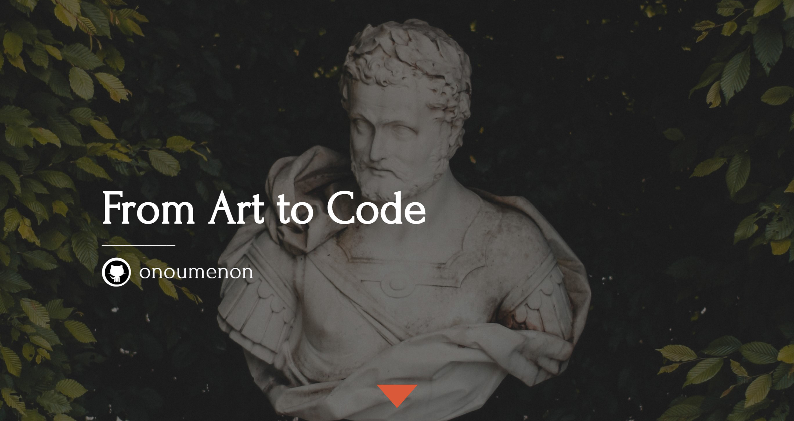
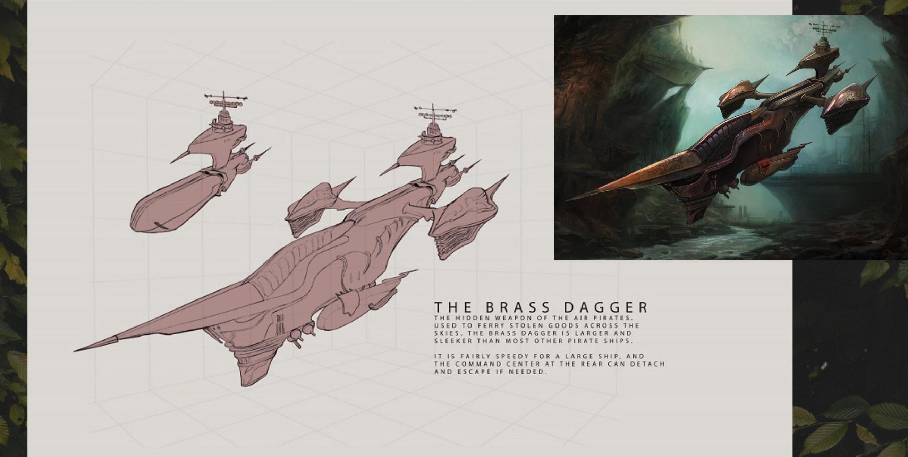
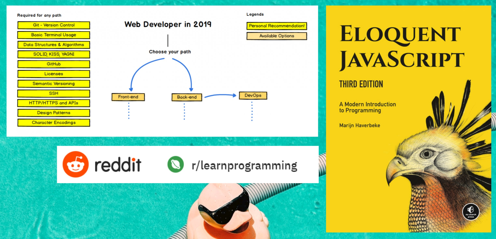

# @onoumenon

Visit the presentation repo at [tiny.cc/bootcamp](https://github.com/onoumenon/codinggirls-tw-presentatio) 
Or refer to more resources at [onoumenon.gitbook.io/wiki](https://onoumenon.gitbook.io/wiki/)

---

---

---

---

---

---

---

---

---

---

---

---

---

---

---

---

---

# Fail small.

---

# Learn in public

---

---

---

---

