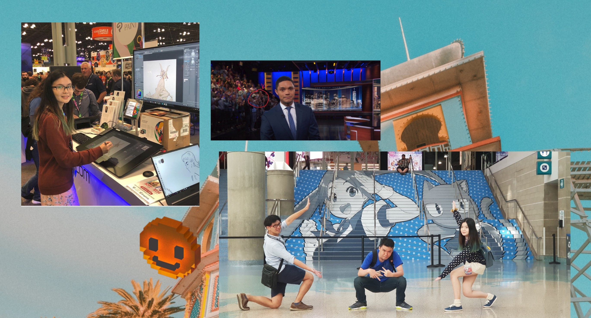
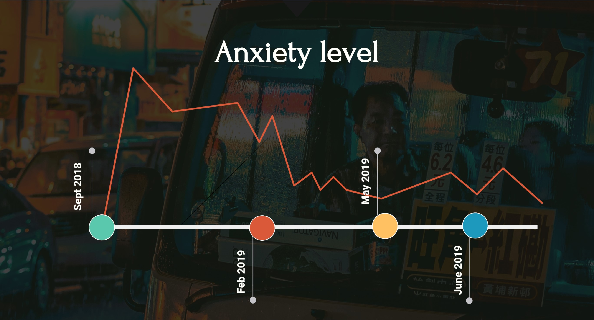
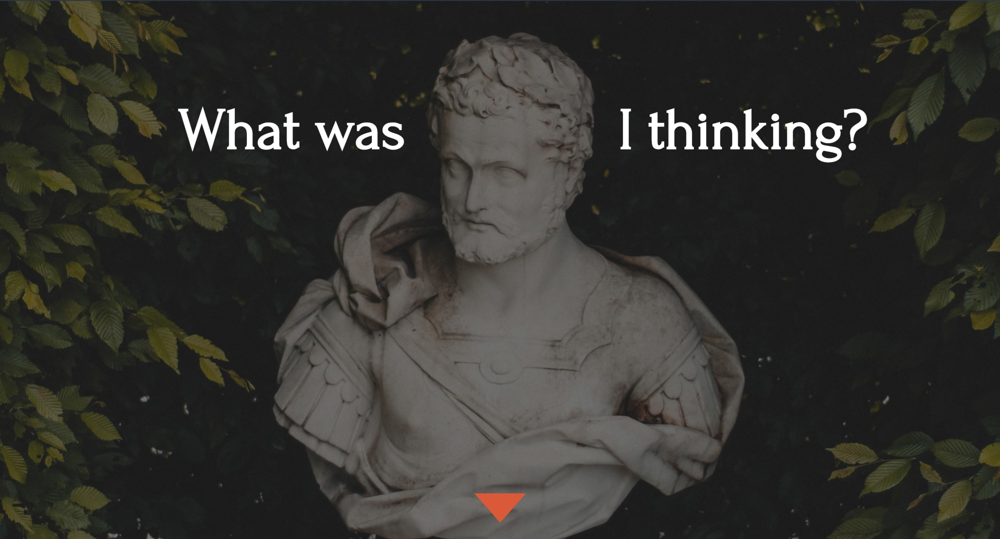
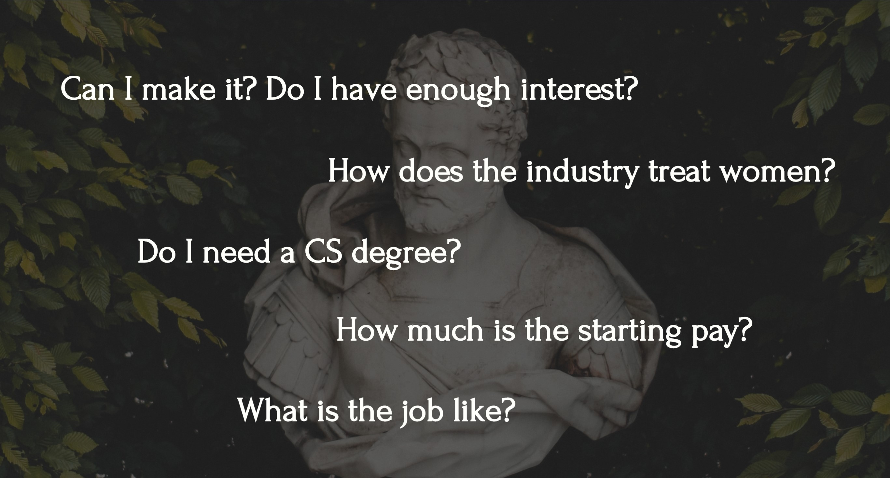
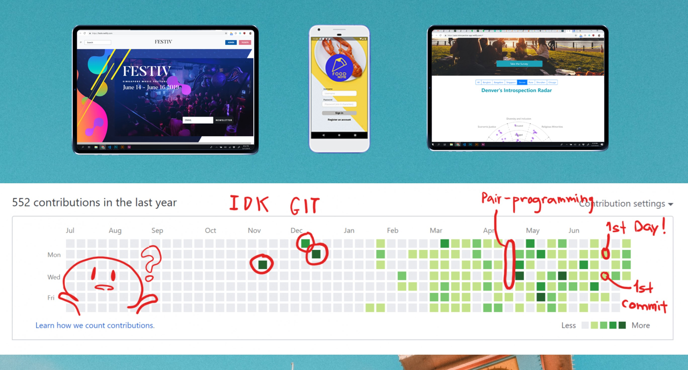

# @onoumenon

Visit the presentation repo at [tiny.cc/bootcamp](https://github.com/onoumenon/codinggirls-tw-presentatio) 

Or refer to more resources at [onoumenon.gitbook.io/wiki](https://onoumenon.gitbook.io/wiki/)

---

---

---

---

---

---

---

---

---

---

---

---

---

---

---

---

---

# You're gonna be okay.

---

# You're gonna get stuck. A lot.

---

# You're gonna fail.

# But fail small.

---

# Know your tools.

---

# The journey so far.

